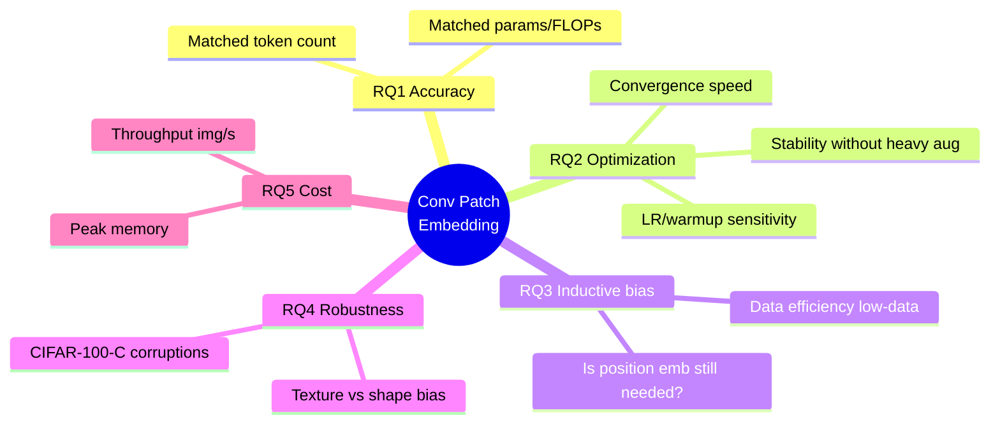
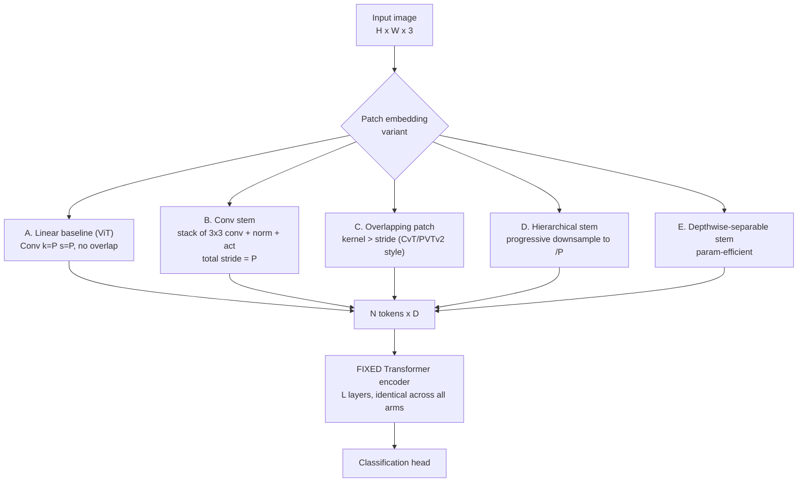
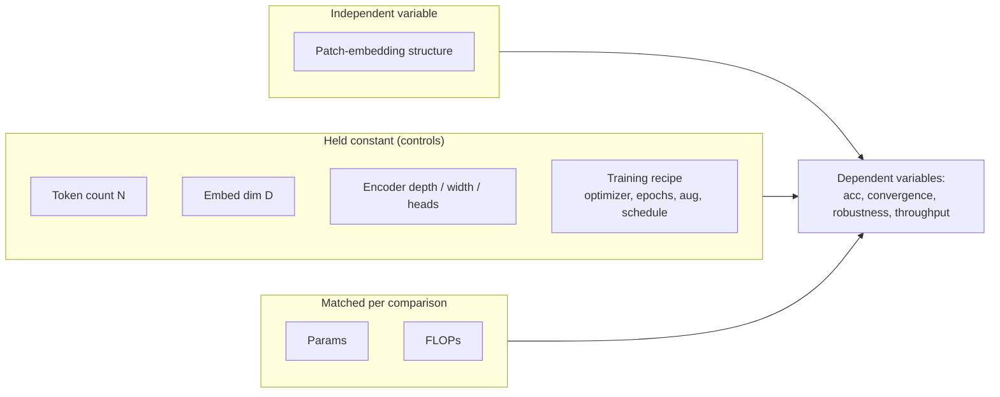
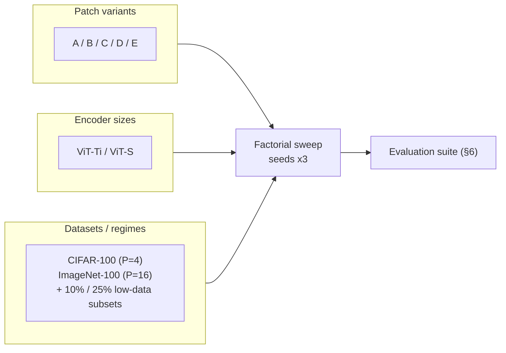
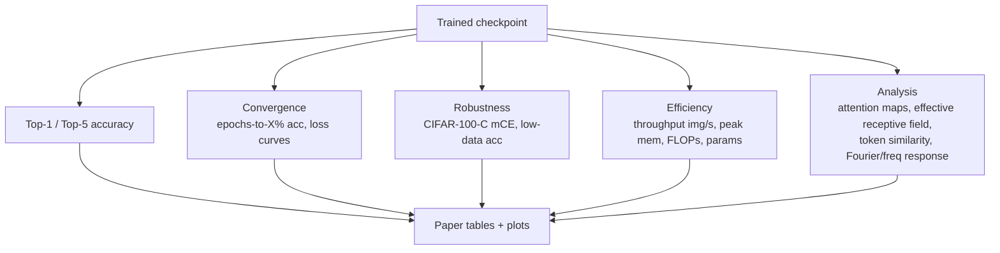
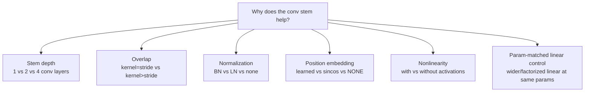
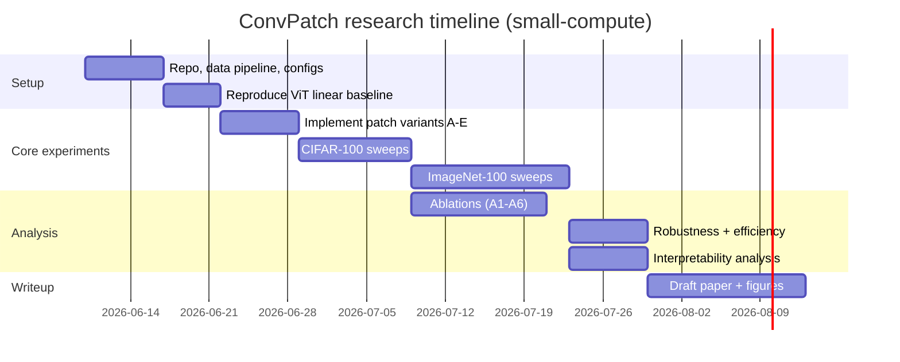

# ConvPatch: Convolutional Patch Embedding for Vision Encoders

> **Type:** Controlled isolation study (rigor-focused)
> **Compute regime:** Small (single-GPU) — CIFAR-100 and ImageNet-100, ViT-Ti / ViT-S
> **One-line thesis:** Holding the Transformer encoder and training recipe fixed, replacing the *linear* patch projection with a small *convolutional stem* improves accuracy, optimization stability, and data efficiency at a matched parameter / FLOP / token budget.

---

## 1. Motivation & hypothesis

Standard Vision Transformers (ViT) "patchify" an image by slicing it into non-overlapping squares (e.g. 16×16), flattening each, and applying a **single linear projection**. That projection is exactly a stride-`P` convolution with kernel `P`: *no overlap, no hierarchy, no locality beyond the patch boundary.*

**Central hypothesis (H0):** A small **convolutional stem** (overlapping, multi-layer, with normalization and nonlinearity) produces tokens that are easier for the Transformer to optimize — yielding higher accuracy, faster/more stable convergence, and better data efficiency — **at matched token count, parameter count, and FLOPs.**

This connects to prior observations (Xiao et al., *Early Convolutions Help Transformers See Better*; CvT; LeViT; PVTv2). **Our contribution is methodological rigor, not a new SOTA number:** a clean "change one thing" study that holds the encoder and recipe fixed and varies *only* the patch-embedding module across a principled design space, with the capacity confound explicitly controlled.

---

## 2. Research questions

> Model-size / full-ImageNet **scaling** is explicitly **out of scope** for this small-compute study and is listed under Future Work (§11).

---

## 3. Design space (the independent variable)

We vary only the patch-embedding module `f: image → tokens`. Every variant emits the **same number of tokens `N`** and the **same embedding dim `D`**, so the downstream encoder is byte-for-byte identical across arms.

### What is held constant vs varied

---

## 4. Architecture detail: linear vs conv stem

**Token-count invariant:** total stem stride must equal `P`. For CIFAR-100 at 32×32 with `P=4` (→ `N=64` tokens), two stride-2 blocks suffice; for ImageNet-100 at 224×224 with `P=16` (→ `N=196` tokens), four stride-2 blocks. The final `1×1` conv guarantees output channels = `D`, matching the linear arm exactly.

---

## 5. Experimental matrix (small-compute factorial)

**Run budget estimate:** 5 variants × 2 sizes × 2 datasets × 3 seeds = 60 main runs, plus low-data and ablation runs. Each fits a single consumer GPU at these resolutions/token counts; CIFAR-100 runs are minutes-to-an-hour, ImageNet-100 a few hours each.

---

## 6. Evaluation pipeline

---

## 7. Ablations — isolate *why* it helps

**A6 and A4 are the load-bearing controls.** A6 rules out "it just has more parameters." A4 tests the common claim that a conv stem injects enough positional information to make explicit position embeddings redundant.

---

## 8. Hypotheses → predicted signals

| RQ  | Hypothesis | Predicted signal |
|-----|-----------|------------------|
| RQ1 | Conv > linear at matched budget | +1–3% top-1, larger gap on smaller data |
| RQ2 | Conv trains more stably | Tolerates higher LR, needs less warmup, lower loss variance |
| RQ3 | Conv adds locality bias | Bigger gains in 10%/25% low-data; pos-emb less critical (A4) |
| RQ4 | Conv more robust | Lower mCE on CIFAR-100-C |
| RQ5 | Conv stem is cheap | < 5% throughput cost vs linear |

---

## 9. Project phases

---

## 10. Threats to validity & mitigations

| Threat | Mitigation |
|--------|-----------|
| Capacity confound (conv just adds params) | Strict param/FLOP matching + A6 wide-linear control |
| Recipe favoritism (recipe tuned for conv) | Identical recipe across arms; report LR-sweep *sensitivity*, not one tuned point |
| Token-count mismatch | Enforce stem stride = `P` so `N` is identical across arms |
| Seed noise (amplified at small scale) | 3 seeds; report mean ± std, especially for low-data |
| Single-dataset cherry-pick | Span CIFAR-100 → ImageNet-100 + low-data subsets |
| Position-embedding interaction | A4 ablation explicitly crosses stem × pos-emb |

---

## 11. Out of scope / future work
- Full ImageNet-1k and ViT-B scaling laws (needs multi-GPU).
- Self-supervised pretraining (MAE/DINO) with conv stems.
- Dense prediction (detection/segmentation) transfer.
- Hybrid conv-attention encoders (we keep the encoder pure to isolate the stem).

---

## 12. Deliverables
- Reproducible config-driven training code, fixed seeds, logged runs.
- Main results table (variant × size × dataset) with mean ± std.
- Ablation tables A1–A6.
- Convergence, robustness, efficiency, and interpretability figures.
- Paper draft positioning this as a controlled isolation study.
