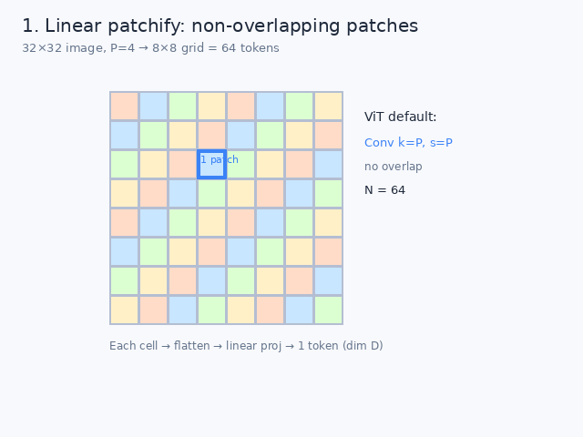
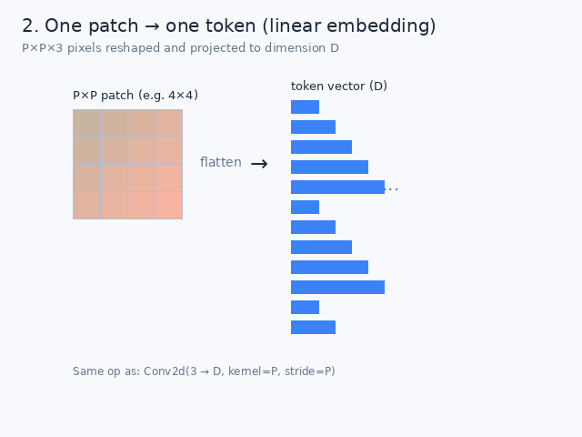
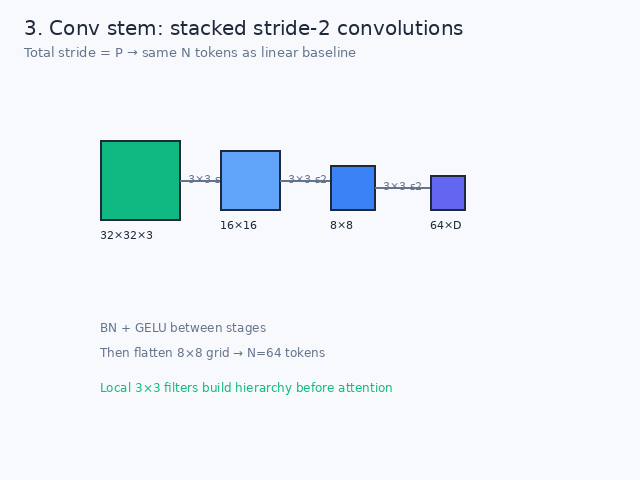
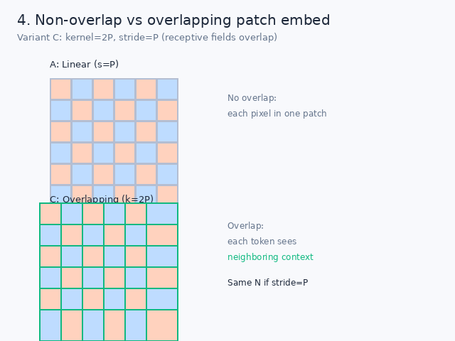
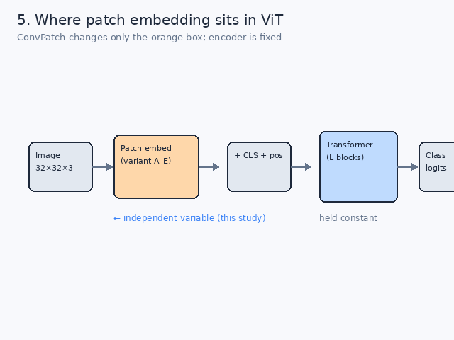
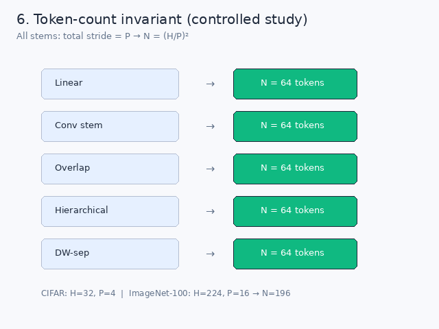

# Patch embedding — visual guide

Dummy schematic figures for understanding how ViT patch embedding works and what ConvPatch compares.

Regenerate: `python paper/figures/generate_dummies.py`

---

## 1. Linear patchify — non-overlapping grid

A 32×32 image is split into an 8×8 grid of **non-overlapping** 4×4 patches (P=4). Each cell becomes one token → **N = 64**. This is the standard ViT stem: `Conv k=P, s=P`.

---

## 2. One patch → one token

Each P×P patch is **flattened** and projected to a vector of dimension **D**. Mathematically the same as a single linear map per patch — or one strided convolution over the whole image.

---

## 3. Conv stem — progressive downsampling

Instead of one large P×P conv, a **stack of 3×3 stride-2** convolutions shrinks 32→16→8. Total stride still equals P, so **N = 64** matches the linear baseline. BN + GELU between stages build local features before attention.

---

## 4. Non-overlap vs overlapping

**Linear (A):** patches do not overlap — each pixel belongs to one patch.  
**Overlapping (C):** kernel = 2P, stride = P — each token’s receptive field spans neighboring regions. Token count stays the same when stride = P.

---

## 5. Where patch embedding sits in ViT

End-to-end flow: **Image → Patch embed → +CLS+pos → Transformer → logits**. In ConvPatch, only the orange **patch-embed** block changes; the encoder and training recipe are held constant.

---

## 6. Same token count across all variants

All five stems (linear, conv, overlapping, hierarchical, depthwise-separable) are constrained so **total stride = P** and every arm outputs the **same N**. This is the core control of the study.

| Setting | H | P | N |
|---------|---|---|---|
| CIFAR | 32 | 4 | 64 |
| ImageNet-100 | 224 | 16 | 196 |
